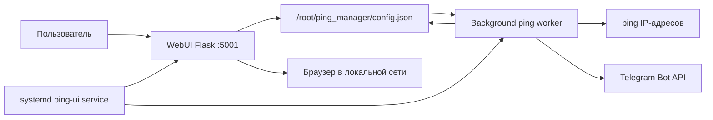

# Ping Manager

Ping Manager - легкий веб-сервис для Raspberry Pi или другого Linux-хоста, который проверяет доступность IP-адресов через `ping` и отправляет уведомления в Telegram только при изменении состояния: `up -> down` или `down -> up`.

Проект вырос из простого cron-скрипта в постоянный Flask-сервис с WebUI, JSON-конфигурацией, systemd-автозапуском и поддержкой SOCKS5-прокси для Telegram.

## Возможности

- WebUI для добавления, редактирования и удаления IP-адресов.
- Двуязычный WebUI: English / Русский, английский язык включен по умолчанию.
- Индивидуальный интервал проверки для каждого IP.
- Ручной запуск проверки для любого IP из WebUI.
- Индивидуальный текст Telegram-сообщений для восстановления и падения.
- Отправка уведомлений только при смене статуса, без спама на каждой проверке.
- Отображение текущего статуса и времени последнего изменения.
- Хранение настроек в JSON-файле.
- Глобальные настройки SOCKS5-прокси для Telegram.
- Ручная проверка SOCKS5-прокси через Telegram API.
- Автозапуск через systemd.

## Состав проекта

```text
ping_manager/
  .env.example              # пример файла с Telegram-переменными
  app.py                    # Flask-приложение, ping worker, Telegram-уведомления
  templates/
    index.html              # WebUI
etc/
  systemd/
    system/
      ping-ui.service       # systemd unit для запуска сервиса
CHANGELOG.md               # история изменений
HISTORY.md                 # исходная история разработки и ручные инструкции
README.md                  # актуальная документация
```

## Архитектурная концепция

Приложение состоит из трех основных частей:

1. `Flask WebUI` - принимает действия пользователя: открыть панель, переключить язык, добавить IP, редактировать IP, удалить IP, вручную проверить IP, сохранить настройки прокси, проверить прокси.
2. `JSON config` - хранит список хостов, интервалы, тексты уведомлений, последние состояния, настройки прокси и выбранный язык интерфейса.
3. `Background ping worker` - постоянно работает в отдельном потоке, проверяет хосты по их интервалам и вызывает Telegram API при смене состояния.



Ключевой принцип: сервис работает постоянно, поэтому cron больше не нужен. Интервалы проверок реализованы внутри фонового потока через поле `last_check` для каждого хоста.

## Как работает состояние

Для каждого IP в `config.json` хранится:

```json
{
    "interval": 60,
    "msg_up": "Host is available",
    "msg_down": "Host access lost",
    "last_state": "unknown",
    "status_time": "",
    "last_check": 0
}
```

Служебные настройки хранятся в ключе `_settings`. В том числе там хранится язык WebUI:

```json
{
    "_settings": {
        "proxy_enabled": false,
        "proxy_ip": "",
        "proxy_port": "1080",
        "language": "en"
    }
}
```

Поддерживаемые значения языка:

- `en` - English, используется по умолчанию.
- `ru` - Русский.

Логика уведомлений:

- `unknown -> up` или `unknown -> down`: отправляется стандартное сообщение текущего состояния.
- `up -> down`: отправляется `msg_down`.
- `down -> up`: отправляется `msg_up`.
- `up -> up` или `down -> down`: уведомление не отправляется.

Так сервис не спамит в Telegram при каждом цикле проверки.

Ручная проверка IP всегда отправляет Telegram-сообщение с текущим состоянием, даже если статус не изменился. К стандартному тексту добавляется префикс `Ручная проверка: `.

## Требования

- Linux-хост, например Raspberry Pi или DietPi.
- Python 3.
- Доступ к команде `ping`.
- Telegram-бот и `chat_id`.
- Доступ к локальной сети для открытия WebUI.

Пакеты Debian/DietPi/Raspberry Pi OS:

```bash
apt update
apt install python3 python3-flask python3-requests python3-socks iputils-ping -y
```

`python3-socks` нужен для SOCKS5-прокси. Без него прямая отправка Telegram будет работать, но отправка через SOCKS5 невозможна.

## Подготовка Telegram

1. Откройте в Telegram `@BotFather`.
2. Создайте бота командой `/newbot`.
3. Скопируйте API token вида `123456789:ABCdefGh...`.
4. Откройте созданного бота и нажмите `Start`.
5. Узнайте свой `chat_id`, например через `@userinfobot`.

В текущей версии token и `chat_id` задаются в файле `/root/ping_manager/.env`:

```bash
TOKEN=ВАШ_ТОКЕН_БОТА
CHAT_ID=ВАШ_CHAT_ID
```

Рекомендуемый формат - без кавычек. Двойные кавычки также допустимы:

```bash
TOKEN="ВАШ_ТОКЕН_БОТА"
CHAT_ID="ВАШ_CHAT_ID"
```

Одинарные кавычки приложение тоже умеет читать, но для совместимости с systemd лучше использовать значения без кавычек или в двойных кавычках. Не добавляйте префикс `bot` перед токеном.

## Установка с нуля

Команды ниже рассчитаны на установку под `root`, как в DietPi.

### 1. Установить зависимости

```bash
apt update
apt install python3 python3-flask python3-requests python3-socks iputils-ping -y
```

### 2. Создать каталог приложения

```bash
mkdir -p /root/ping_manager/templates
```

### 3. Скопировать файлы проекта

Скопируйте файлы из репозитория на Raspberry Pi:

```bash
cp ping_manager/app.py /root/ping_manager/app.py
cp ping_manager/.env.example /root/ping_manager/.env
cp ping_manager/templates/index.html /root/ping_manager/templates/index.html
cp etc/systemd/system/ping-ui.service /etc/systemd/system/ping-ui.service
```

Если файлы копируются с другой машины, используйте `scp`:

```bash
scp ping_manager/app.py root@RASPBERRY_PI_IP:/root/ping_manager/app.py
scp ping_manager/.env.example root@RASPBERRY_PI_IP:/root/ping_manager/.env
scp ping_manager/templates/index.html root@RASPBERRY_PI_IP:/root/ping_manager/templates/index.html
scp etc/systemd/system/ping-ui.service root@RASPBERRY_PI_IP:/etc/systemd/system/ping-ui.service
```

### 4. Указать Telegram token и chat_id

Откройте файл переменных:

```bash
nano /root/ping_manager/.env
```

Замените значения:

```bash
TOKEN=ВАШ_ТОКЕН_БОТА
CHAT_ID=ВАШ_CHAT_ID
```

Кавычки обычно не нужны. Если хотите использовать кавычки, используйте двойные:

```bash
TOKEN="ВАШ_ТОКЕН_БОТА"
CHAT_ID="ВАШ_CHAT_ID"
```

Файл `/root/ping_manager/.env` читает само приложение. Unit-файл systemd также подключает его через `EnvironmentFile`, чтобы переменные были видны процессу сервиса.

### 5. Проверить синтаксис

```bash
python3 -m py_compile /root/ping_manager/app.py
```

Если команда ничего не вывела, синтаксис корректный.

### 6. Включить и запустить systemd-сервис

```bash
systemctl daemon-reload
systemctl enable ping-ui.service
systemctl start ping-ui.service
```

### 7. Проверить статус

```bash
systemctl status ping-ui.service
```

Ожидаемое состояние:

```text
active (running)
```

### 8. Открыть WebUI

Узнайте IP Raspberry Pi:

```bash
hostname -I
```

Откройте в браузере:

```text
http://RASPBERRY_PI_IP:5001
```

Актуальный порт в `app.py` - `5001`.

## Настройка хостов

В WebUI можно:

- добавить IP-адрес;
- редактировать IP-адрес, интервал проверки и тексты уведомлений;
- задать интервал проверки в секундах;
- задать текст сообщения при восстановлении;
- задать текст сообщения при падении;
- вручную запустить проверку конкретного IP кнопкой `Проверить`;
- удалить хост из мониторинга.

После добавления хоста первая автоматическая проверка фиксирует состояние и сразу отправляет Telegram-сообщение с текстом `msg_up` или `msg_down`.

Кнопка `Проверить` запускает ping немедленно, обновляет `last_check`, фиксирует новый статус и показывает результат в верхней части страницы. Telegram-сообщение отправляется всегда, даже если статус не изменился. Текст строится из стандартного сообщения текущего состояния с добавлением префикса `Ручная проверка: `.

Кнопка `Редактировать` открывает форму с текущими значениями хоста. При сохранении можно изменить IP, интервал и тексты уведомлений. Текущее состояние, время последнего изменения и время последней проверки сохраняются. Если IP изменен, запись переносится на новый адрес.

## Переключение языка

В верхней части WebUI есть переключатель `Language` / `Язык`.

Доступные языки:

- `English` - выбран по умолчанию для новых установок.
- `Русский` - русская локализация интерфейса.

Выбранный язык сохраняется в `/root/ping_manager/config.json` в поле `_settings.language` и применяется после переключения без перезапуска сервиса.

Переводится интерфейс и системные сообщения WebUI. Пользовательские тексты уведомлений `msg_up` и `msg_down` не переводятся автоматически, потому что это ваши собственные тексты Telegram-сообщений.

## Настройка SOCKS5-прокси

В верхнем блоке WebUI доступны:

- IP прокси;
- порт прокси;
- флажок включения прокси.
- кнопка `Проверить прокси через Telegram`.

После сохранения настройки применяются без перезапуска сервиса, потому что `send_telegram()` читает конфиг перед каждой отправкой.

Для SOCKS5 используется схема `socks5h://`, поэтому DNS-запросы к Telegram тоже идут через прокси.

Если прокси включен, но недоступен или в системе нет поддержки SOCKS, сервис пишет ошибку в лог и пробует отправить сообщение напрямую.

Кнопка проверки прокси делает запрос к Telegram Bot API `getMe` строго через указанные IP и порт SOCKS5-прокси. Проверку можно запускать даже до включения флажка `Включить прокси`, чтобы сначала убедиться, что адрес работает. Для проверки нужен `TOKEN` в `/root/ping_manager/.env`; `CHAT_ID` для этой операции не используется.

## Обновление установленной версии

### 1. Сделать резервную копию конфига

```bash
cp /root/ping_manager/config.json /root/ping_manager/config.json.bak
```

`config.json` содержит ваши хосты, интервалы, статусы и настройки прокси. При обновлении его обычно не нужно заменять.

### 2. Остановить сервис

```bash
systemctl stop ping-ui.service
```

### 3. Скопировать новые файлы приложения

```bash
cp ping_manager/app.py /root/ping_manager/app.py
cp ping_manager/templates/index.html /root/ping_manager/templates/index.html
```

Если изменился unit-файл:

```bash
cp etc/systemd/system/ping-ui.service /etc/systemd/system/ping-ui.service
systemctl daemon-reload
```

### 4. Проверить Telegram token и chat_id

Telegram-настройки хранятся отдельно от кода, поэтому при обычном обновлении `app.py` их переносить не нужно. Проверьте файл:

```bash
nano /root/ping_manager/.env
```

Формат:

```bash
TOKEN=ВАШ_ТОКЕН_БОТА
CHAT_ID=ВАШ_CHAT_ID
```

### 5. Проверить синтаксис

```bash
python3 -m py_compile /root/ping_manager/app.py
```

### 6. Запустить сервис

```bash
systemctl start ping-ui.service
systemctl status ping-ui.service
```

Если systemd заблокировал частые перезапуски после ошибок:

```bash
systemctl reset-failed ping-ui.service
systemctl restart ping-ui.service
```

## Диагностика

### Сервис не запускается

Проверьте статус:

```bash
systemctl status ping-ui.service
```

Посмотрите последние логи:

```bash
journalctl -u ping-ui.service -n 50 --no-pager
```

Частые причины:

- синтаксическая ошибка в `app.py`;
- не создан или неверно заполнен `/root/ping_manager/.env`;
- не установлен `python3-flask`;
- неправильный путь в `/etc/systemd/system/ping-ui.service`.

### WebUI не открывается

Проверьте, слушает ли сервис порт:

```bash
ss -tulpn | grep 5001
```

Проверьте IP устройства:

```bash
hostname -I
```

Откройте:

```text
http://RASPBERRY_PI_IP:5001
```

### Telegram не отправляет сообщения

Проверьте:

- бот был запущен пользователем через `Start`;
- `TOKEN` в `/root/ping_manager/.env` указан без префикса `bot`;
- `CHAT_ID` в `/root/ping_manager/.env` указан правильно;
- устройство имеет доступ к `api.telegram.org`;
- при включенном SOCKS5 установлен пакет `python3-socks`;
- если прокси включен, IP и порт прокси доступны с Raspberry Pi.

Логи отправки:

```bash
journalctl -u ping-ui.service -n 100 --no-pager
```

### Проверка прокси из WebUI падает

Проверьте:

- IP и порт прокси указаны корректно;
- пакет `python3-socks` установлен;
- Telegram `TOKEN` задан в `/root/ping_manager/.env`;
- Raspberry Pi может подключиться к SOCKS5-прокси по указанному адресу.

Команда для установки поддержки SOCKS5:

```bash
apt install python3-socks -y
```

## Автотесты

В проект добавлен набор `pytest`-тестов для проверки конфигурации, локализации, Telegram-отправки, SOCKS5-прокси и основных Flask routes.

Локальный запуск:

```bash
python3 -m pip install -r requirements-dev.txt
python3 -m pytest -q
```

Автоматический запуск настроен в GitHub Actions: `.github/workflows/tests.yml`.

Workflow запускается при:

- push в ветку `main`;
- pull request.

## Удаление старого cron

Ранняя версия проекта запускалась через cron. Актуальная версия работает постоянно через systemd, поэтому cron-запись для старого `ping_check.py` нужно удалить.

```bash
crontab -e
```

Удалите строку вида:

```text
* * * * * /usr/bin/python3 /root/ping_check.py
```

## Безопасность и ограничения

- WebUI не имеет авторизации. Используйте его только в доверенной локальной сети или закройте доступ firewall-ом.
- Telegram token хранится в `/root/ping_manager/.env`. Не публикуйте этот файл с реальным token.
- `config.json` создается автоматически в `/root/ping_manager/config.json`.
- Tailwind CSS подключается с CDN в HTML-шаблоне, поэтому для красивого оформления браузеру нужен доступ к интернету. Базовая HTML-страница при этом остается доступной.

## Быстрая шпаргалка

Перезапуск:

```bash
systemctl restart ping-ui.service
```

Статус:

```bash
systemctl status ping-ui.service
```

Логи:

```bash
journalctl -u ping-ui.service -n 100 --no-pager
```

Адрес WebUI:

```text
http://RASPBERRY_PI_IP:5001
```
