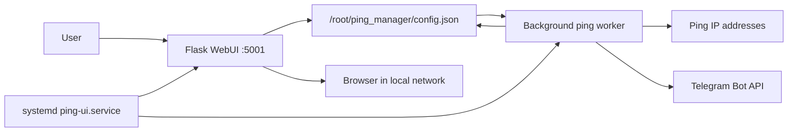

# Ping Manager

Ping Manager is a lightweight web service for Raspberry Pi or any other Linux host. It checks IP address availability with `ping` and sends Telegram notifications when a host state is detected or changes.

The project evolved from a simple cron script into a persistent Flask service with a WebUI, JSON configuration, systemd autostart, bilingual interface, and SOCKS5 proxy support for Telegram.

## Features

- WebUI for adding, editing, and deleting IP addresses.
- Bilingual WebUI: English / Russian, English is the default language.
- Per-host check interval.
- Manual check button for every host.
- Custom Telegram messages for available and unavailable states.
- Automatic notifications on first check and on state changes.
- Manual check notifications even when the state did not change.
- Current status and last state-change time display.
- JSON-based configuration.
- Global SOCKS5 proxy settings for Telegram.
- Manual SOCKS5 proxy check via Telegram API.
- systemd autostart.

## Project Layout

```text
ping_manager/
  .env.example              # example Telegram environment file
  app.py                    # Flask app, ping worker, Telegram notifications
  templates/
    index.html              # WebUI
etc/
  systemd/
    system/
      ping-ui.service       # systemd unit for running the service
CHANGELOG.md               # Russian changelog
CHANGELOG_EN.md            # English changelog
HISTORY.md                 # original development history and manual instructions
README.md                  # Russian documentation
README_EN.md               # English documentation
```

## Architecture

The application has three main parts:

1. `Flask WebUI` - handles user actions: open the panel, switch language, add IP, edit IP, delete IP, manually check IP, save proxy settings, and check proxy.
2. `JSON config` - stores hosts, intervals, notification texts, last states, proxy settings, and selected UI language.
3. `Background ping worker` - runs continuously in a separate thread, checks hosts according to their intervals, and calls Telegram API when a notification is required.



Key principle: the service runs continuously, so cron is no longer required. Check intervals are handled inside the background worker using the `last_check` field for each host.

## State Model

Each IP in `config.json` stores:

```json
{
    "interval": 60,
    "msg_up": "Host is available",
    "msg_down": "Host access lost",
    "last_state": "unknown",
    "status_time": "",
    "last_check": 0
}
```

Service settings are stored under `_settings`, including the WebUI language:

```json
{
    "_settings": {
        "proxy_enabled": false,
        "proxy_ip": "",
        "proxy_port": "1080",
        "language": "en"
    }
}
```

Supported language values:

- `en` - English, used by default.
- `ru` - Russian.

Notification logic:

- `unknown -> up` or `unknown -> down`: sends the standard message for the current state.
- `up -> down`: sends `msg_down`.
- `down -> up`: sends `msg_up`.
- `up -> up` or `down -> down`: no automatic notification is sent.

This avoids repeated Telegram spam during normal automatic checks.

Manual IP checks always send a Telegram message with the current state, even when the state did not change. The standard message is prefixed with `Manual check: ` in English UI mode or `Ручная проверка: ` in Russian UI mode.

## Requirements

- Linux host, for example Raspberry Pi or DietPi.
- Python 3.
- Available `ping` command.
- Telegram bot and `chat_id`.
- Local network access to open the WebUI.

Packages for Debian/DietPi/Raspberry Pi OS:

```bash
apt update
apt install python3 python3-flask python3-requests python3-socks iputils-ping -y
```

`python3-socks` is required for SOCKS5 proxy support. Direct Telegram sending can work without it, but sending through SOCKS5 cannot.

## Telegram Setup

1. Open `@BotFather` in Telegram.
2. Create a bot with `/newbot`.
3. Copy the API token, for example `123456789:ABCdefGh...`.
4. Open your new bot and press `Start`.
5. Get your `chat_id`, for example via `@userinfobot`.

In the current version, token and `chat_id` are stored in `/root/ping_manager/.env`:

```bash
TOKEN=YOUR_BOT_TOKEN
CHAT_ID=YOUR_CHAT_ID
```

Recommended format: no quotes. Double quotes are also supported:

```bash
TOKEN="YOUR_BOT_TOKEN"
CHAT_ID="YOUR_CHAT_ID"
```

The application can also read single quotes, but for systemd `EnvironmentFile` compatibility use unquoted values or double quotes. Do not add the `bot` prefix before the token.

## Fresh Installation

The commands below assume installation as `root`, as commonly used on DietPi.

### 1. Install Dependencies

```bash
apt update
apt install python3 python3-flask python3-requests python3-socks iputils-ping -y
```

### 2. Create Application Directory

```bash
mkdir -p /root/ping_manager/templates
```

### 3. Copy Project Files

Copy files from the repository to Raspberry Pi:

```bash
cp ping_manager/app.py /root/ping_manager/app.py
cp ping_manager/.env.example /root/ping_manager/.env
cp ping_manager/templates/index.html /root/ping_manager/templates/index.html
cp etc/systemd/system/ping-ui.service /etc/systemd/system/ping-ui.service
```

If copying from another machine, use `scp`:

```bash
scp ping_manager/app.py root@RASPBERRY_PI_IP:/root/ping_manager/app.py
scp ping_manager/.env.example root@RASPBERRY_PI_IP:/root/ping_manager/.env
scp ping_manager/templates/index.html root@RASPBERRY_PI_IP:/root/ping_manager/templates/index.html
scp etc/systemd/system/ping-ui.service root@RASPBERRY_PI_IP:/etc/systemd/system/ping-ui.service
```

### 4. Configure Telegram token and chat_id

Open the environment file:

```bash
nano /root/ping_manager/.env
```

Replace values:

```bash
TOKEN=YOUR_BOT_TOKEN
CHAT_ID=YOUR_CHAT_ID
```

Quotes are usually not needed. If you prefer quotes, use double quotes:

```bash
TOKEN="YOUR_BOT_TOKEN"
CHAT_ID="YOUR_CHAT_ID"
```

The application reads `/root/ping_manager/.env` directly. The systemd unit also loads it via `EnvironmentFile`, so the variables are visible to the service process.

### 5. Check Syntax

```bash
python3 -m py_compile /root/ping_manager/app.py
```

If the command prints nothing, syntax is valid.

### 6. Enable and Start the systemd Service

```bash
systemctl daemon-reload
systemctl enable ping-ui.service
systemctl start ping-ui.service
```

### 7. Check Status

```bash
systemctl status ping-ui.service
```

Expected state:

```text
active (running)
```

### 8. Open WebUI

Find Raspberry Pi IP:

```bash
hostname -I
```

Open in browser:

```text
http://RASPBERRY_PI_IP:5001
```

The current port in `app.py` is `5001`.

## Host Configuration

In WebUI you can:

- add an IP address;
- edit IP address, check interval, and notification texts;
- set check interval in seconds;
- set message text for recovery;
- set message text for failure;
- manually run a check with the `Check` button;
- delete a host from monitoring.

After adding a host, the first automatic check records the state and immediately sends a Telegram message with `msg_up` or `msg_down`.

The `Check` button runs ping immediately, updates `last_check`, records the current status, and shows the result at the top of the page. A Telegram message is always sent, even when the state did not change. The message is built from the standard current-state text with the `Manual check: ` prefix.

The `Edit` button opens a form with the current host values. You can change IP, interval, and notification texts. Current state, last state-change time, and last check time are preserved. If IP is changed, the record is moved to the new address.

## Language Switching

At the top of the WebUI there is a `Language` selector.

Available languages:

- `English` - selected by default for fresh installations.
- `Russian` - Russian UI localization.

The selected language is stored in `/root/ping_manager/config.json` under `_settings.language` and applies immediately without restarting the service.

The UI and system WebUI messages are translated. User-provided notification texts `msg_up` and `msg_down` are not translated automatically because they are custom Telegram messages.

## SOCKS5 Proxy Configuration

The top WebUI block provides:

- proxy IP;
- proxy port;
- proxy enable checkbox;
- `Check proxy via Telegram` button.

After saving, settings apply without restarting the service because `send_telegram()` reads config before every send.

SOCKS5 uses the `socks5h://` scheme, so DNS requests to Telegram also go through the proxy.

If proxy is enabled but unavailable, or SOCKS support is missing, the service logs the error and tries direct sending.

The proxy check button calls Telegram Bot API `getMe` strictly through the configured SOCKS5 IP and port. You can run the check even before enabling the proxy checkbox, so you can verify the address first. The check requires `TOKEN` in `/root/ping_manager/.env`; `CHAT_ID` is not used for this operation.

## Updating an Installed Version

### 1. Back Up Config

```bash
cp /root/ping_manager/config.json /root/ping_manager/config.json.bak
```

`config.json` contains hosts, intervals, states, proxy settings, and selected UI language. Usually it should not be replaced during updates.

### 2. Stop Service

```bash
systemctl stop ping-ui.service
```

### 3. Copy New Application Files

```bash
cp ping_manager/app.py /root/ping_manager/app.py
cp ping_manager/templates/index.html /root/ping_manager/templates/index.html
```

If the unit file changed:

```bash
cp etc/systemd/system/ping-ui.service /etc/systemd/system/ping-ui.service
systemctl daemon-reload
```

### 4. Check Telegram token and chat_id

Telegram settings are stored separately from code, so normal `app.py` updates do not require moving them. Check the file:

```bash
nano /root/ping_manager/.env
```

Format:

```bash
TOKEN=YOUR_BOT_TOKEN
CHAT_ID=YOUR_CHAT_ID
```

### 5. Check Syntax

```bash
python3 -m py_compile /root/ping_manager/app.py
```

### 6. Start Service

```bash
systemctl start ping-ui.service
systemctl status ping-ui.service
```

If systemd blocked frequent restarts after failures:

```bash
systemctl reset-failed ping-ui.service
systemctl restart ping-ui.service
```

## Diagnostics

### Service does not start

Check status:

```bash
systemctl status ping-ui.service
```

View recent logs:

```bash
journalctl -u ping-ui.service -n 50 --no-pager
```

Common causes:

- syntax error in `app.py`;
- missing or invalid `/root/ping_manager/.env`;
- `python3-flask` is not installed;
- wrong path in `/etc/systemd/system/ping-ui.service`.

### WebUI does not open

Check whether the service listens on the port:

```bash
ss -tulpn | grep 5001
```

Check device IP:

```bash
hostname -I
```

Open:

```text
http://RASPBERRY_PI_IP:5001
```

### Telegram messages are not sent

Check:

- user pressed `Start` in the bot chat;
- `TOKEN` in `/root/ping_manager/.env` has no `bot` prefix;
- `CHAT_ID` in `/root/ping_manager/.env` is correct;
- the device can reach `api.telegram.org`;
- `python3-socks` is installed when SOCKS5 is enabled;
- if proxy is enabled, proxy IP and port are reachable from Raspberry Pi.

Sending logs:

```bash
journalctl -u ping-ui.service -n 100 --no-pager
```

### Proxy check from WebUI fails

Check:

- proxy IP and port are correct;
- `python3-socks` is installed;
- Telegram `TOKEN` is set in `/root/ping_manager/.env`;
- Raspberry Pi can connect to the SOCKS5 proxy address.

Install SOCKS5 support:

```bash
apt install python3-socks -y
```

## Removing Old Cron

The early project version was started by cron. The current version runs continuously via systemd, so remove the old `ping_check.py` cron entry.

```bash
crontab -e
```

Remove a line like:

```text
* * * * * /usr/bin/python3 /root/ping_check.py
```

## Security and Limitations

- WebUI has no authentication. Use it only in a trusted local network or restrict access with a firewall.
- Telegram token is stored in `/root/ping_manager/.env`. Do not publish this file with a real token.
- `config.json` is created automatically at `/root/ping_manager/config.json`.
- Tailwind CSS is loaded from CDN in the HTML template, so the browser needs internet access for the styled UI. The basic HTML page remains available without it.

## Quick Reference

Restart:

```bash
systemctl restart ping-ui.service
```

Status:

```bash
systemctl status ping-ui.service
```

Logs:

```bash
journalctl -u ping-ui.service -n 100 --no-pager
```

WebUI address:

```text
http://RASPBERRY_PI_IP:5001
```
